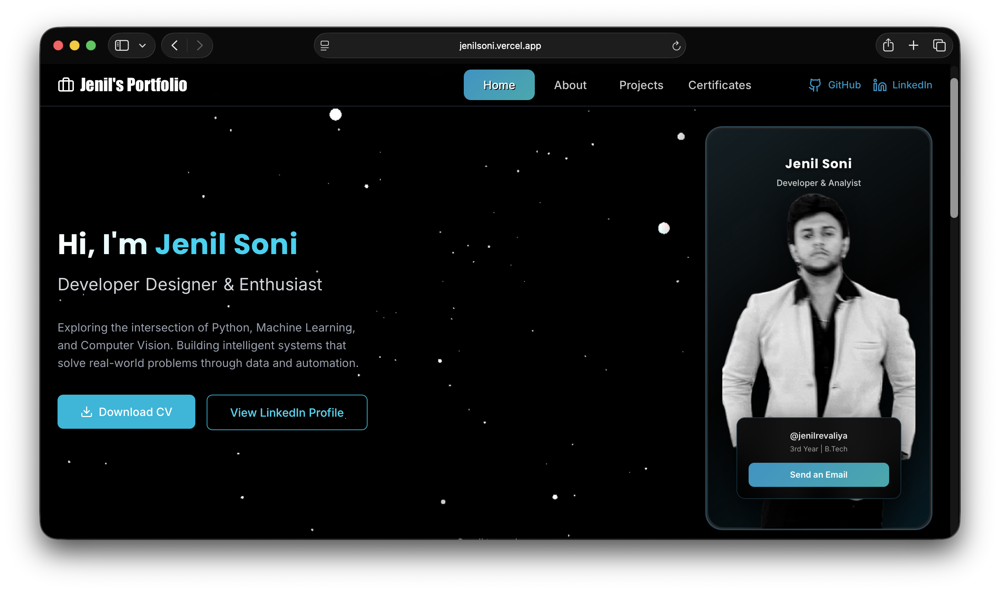
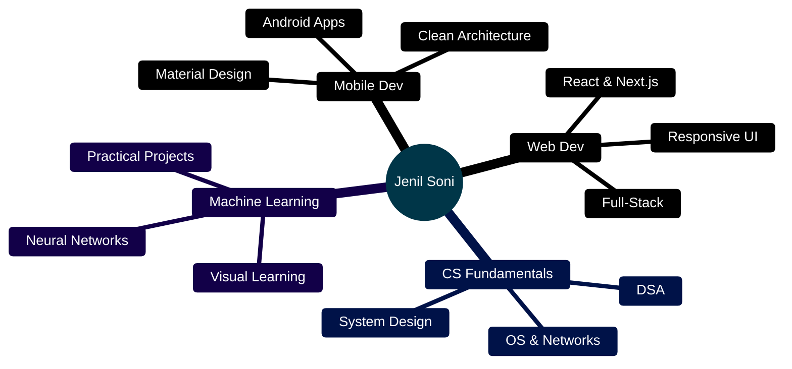

<div align="center">

<!-- Custom Animated Header with "Hi, I'm Jenil" on Wave Banner -->


<br/>

<!-- Social Links with Blue Theme -->
<p align="center">
  <a href="https://jenilsoni.vercel.app">
    
  </a>
  <a href="https://github.com/JenilRevaliya">
    
  </a>
  <a href="https://linkedin.com/in/jenil-revaliya">
    
  </a>
  <a href="mailto:jenilrevaliya@example.com">
    
  </a>
</p>


</div>

<br/>

<h2><font color="#0096c7" size="6">#</font> Gallery</h2>

<div align="center">

<p>
  
  
  
</p>

<p>
  
  
  
</p>

</div>

<br/>

<h2><font color="#0096c7" size="6">#</font> About</h2>

```typescript
const jenil = {
    role: "Full-Stack Developer & CS Student",
    focus: ["Android", "Web", "ML", "System Design"],
    mindset: "Deep fundamentals → Clean code → Real impact",
    
    currentlyLearning: () => {
        return ["Advanced Android", "React Ecosystem", "ML Visualization"];
    },
    
    philosophy: "Build to learn. Understand before implementing."
};
```

<br/>

<h2><font color="#0096c7" size="6">#</font> Tech Arsenal</h2>

<div align="center">

### Languages
<p>
  
</p>

### Frameworks & Tools
<p>
  
</p>

### Databases & More
<p>
  
</p>

</div>

<br/>

<h2><font color="#0096c7" size="6">#</font> Featured Projects</h2>

<div align="center">

<table>
<tr>
<td width="50%" align="center">


**💰 Expense Splitter**  
`Kotlin` `MVVM` `Room` `Android`

</td>
<td width="50%" align="center">


**🌐 Portfolio Site**  
`React` `Next.js` `TailwindCSS`

</td>
</tr>
<tr>
<td width="50%" align="center">


**🎮 ML Racing Game**  
`Python` `TensorFlow` `Pygame`

</td>
<td width="50%" align="center">


**📚 DSA Solutions**  
`C++` `Java` `Algorithms`

</td>
</tr>
</table>

</div>

<br/>

<h2><font color="#0096c7" size="6">#</font> GitHub Stats</h2>

<div align="center">
  
  
</div>

<br/>

<h2><font color="#0096c7" size="6">#</font> Coding Philosophy</h2>

<div align="center">

| 🎯 | 🏗️ | 🔨 | 🧠 |
|:---:|:---:|:---:|:---:|
| **Understand First** | **Strong Foundations** | **Build to Learn** | **Visualize Concepts** |
| Why before how | Basics before abstractions | Practice > Theory | Clarity through visuals |

</div>

<br/>

<h2><font color="#0096c7" size="6">#</font> Achievements</h2>

<div align="center">


</div>

<br/>

<h2><font color="#0096c7" size="6">#</font> Contribution Graph</h2>

<div align="center">


</div>

<br/>

<h2><font color="#0096c7" size="6">#</font> Contribution Snake</h2>

<div align="center">

<picture>
  <source media="(prefers-color-scheme: dark)" srcset="https://raw.githubusercontent.com/platane/snk/output/github-contribution-grid-snake-dark.svg">
  <source media="(prefers-color-scheme: light)" srcset="https://raw.githubusercontent.com/platane/snk/output/github-contribution-grid-snake.svg">
  
</picture>

</div>

<br/>

<h2><font color="#0096c7" size="6">#</font> Current Focus</h2>

<div align="center">



</div>

<br/>

<div align="center">

### 💡 *"Strong foundations. Clear code. Real impact."*


<br/><br/>

<!-- Bottom Wave with Blue Theme -->


</div>
