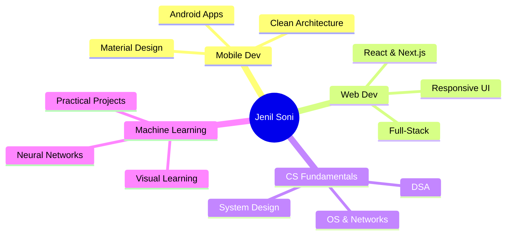

<div align="center">

<!-- Animated Banner -->


<!-- Typing Animation -->


<br/>

<!-- Social Links -->
<p align="center">
  <a href="https://jenilsoni.vercel.app">
    
  </a>
  <a href="https://github.com/JenilRevaliya">
    
  </a>
  <a href="https://linkedin.com/in/jenil-revaliya">
    
  </a>
  <a href="mailto:jenilrevaliya@example.com">
    
  </a>
</p>


</div>

<br/>

## 🎯 About

```typescript
const jenil = {
    role: "Full-Stack Developer & CS Student",
    focus: ["Android", "Web", "ML", "System Design"],
    mindset: "Deep fundamentals → Clean code → Real impact",
    
    currentlyLearning: () => {
        return ["Advanced Android", "React Ecosystem", "ML Visualization"];
    },
    
    philosophy: "Build to learn. Understand before implementing."
};
```

<br/>

## � Tech Arsenal

<div align="center">

### Languages
<p>
  
</p>

### Frameworks & Tools
<p>
  
</p>

### Databases & More
<p>
  
</p>

</div>

<br/>

## 🚀 Featured Projects

<div align="center">

<table>
<tr>
<td width="50%" align="center">


**💰 Expense Splitter**  
`Kotlin` `MVVM` `Room` `Android`

</td>
<td width="50%" align="center">


**� Portfolio Site**  
`React` `Next.js` `TailwindCSS`

</td>
</tr>
<tr>
<td width="50%" align="center">


**🎮 ML Racing Game**  
`Python` `TensorFlow` `Pygame`

</td>
<td width="50%" align="center">


**📚 DSA Solutions**  
`C++` `Java` `Algorithms`

</td>
</tr>
</table>

</div>

<br/>

## 📊 GitHub Stats

<div align="center">
  
  
</div>

<div align="center">
  
  
</div>

<br/>

## 🎨 Coding Philosophy

<div align="center">

| 🎯 | 🏗️ | 🔨 | 🧠 |
|:---:|:---:|:---:|:---:|
| **Understand First** | **Strong Foundations** | **Build to Learn** | **Visualize Concepts** |
| Why before how | Basics before abstractions | Practice > Theory | Clarity through visuals |

</div>

<br/>

## 🏆 Achievements

<div align="center">


</div>

<br/>

## � Contribution Graph

<div align="center">


</div>

<br/>

## 🐍 Contribution Snake

<div align="center">

<picture>
  <source media="(prefers-color-scheme: dark)" srcset="https://raw.githubusercontent.com/JenilRevaliya/JenilRevaliya/output/github-contribution-grid-snake-dark.svg">
  <source media="(prefers-color-scheme: light)" srcset="https://raw.githubusercontent.com/JenilRevaliya/JenilRevaliya/output/github-contribution-grid-snake.svg">
  
</picture>

</div>

<br/>

## 💭 Current Focus

<div align="center">



</div>

<br/>

## 🎵 Spotify Playing

<div align="center">

[](https://open.spotify.com/user/YOUR_SPOTIFY_ID)

</div>

<br/>

<div align="center">

### 💡 *"Strong foundations. Clear code. Real impact."*


</div>
